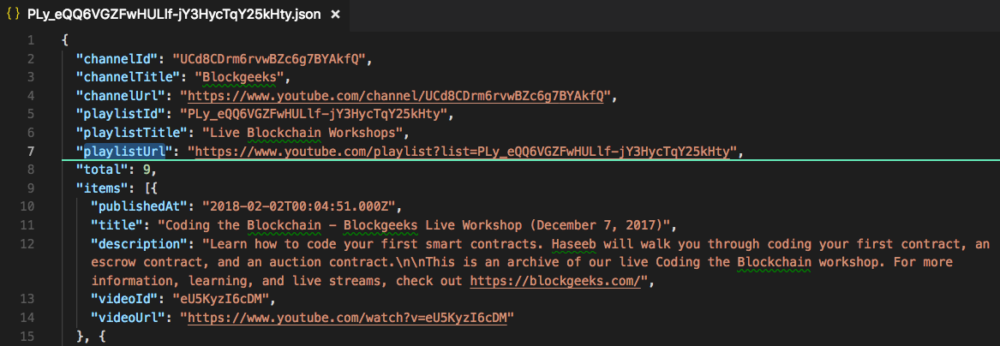
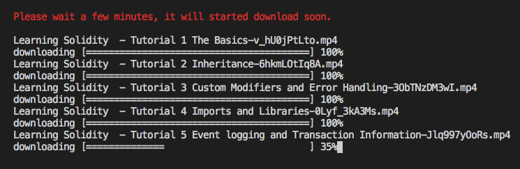

# Youtube Playlist CLI


[](https://david-dm.org/alincode/youtube-playlist-markdown-cli)

It is a Youtube CLI tool to help you do many things.

### Feature

* It could help you quickly **download the videos**.
* It could help you quickly review playlist items information
* It could help you quickly generate **markdown** file.
* It could help you quickly generate **json** file.

### Requirements

* node 8.x.x

### Install

```sh
npm install -g youtube-playlist-cli
```

#### set your google api key

you need to get your API key, if you don't know how to do, maybe this video could help you.

[how to create YouTube API Key 2019 - YouTube](https://www.youtube.com/watch?v=3jZ5vnv-LZc)

then set up env

```
// for Mac
export GOOGLE_API_KEY="========== YOUR GOOGLE API KEY =========="
export DOWNLOAD_FOLDER="/Users/ailinliu/Downloads"

// for Windows
set GOOGLE_API_KEY="========== YOUR GOOGLE API KEY =========="
set DOWNLOAD_FOLDER="C:\"
```

[How To Edit System Environment Variables In Windows 10 - YouTube](https://www.youtube.com/watch?v=C-U9SGaNbwY)

### Usage via command mode


```
yp

yp -c UCJi9ZAuo99MqMuJUXiJjpsA
yp -C UCJi9ZAuo99MqMuJUXiJjpsA

yp -p PLrG78JjvL7hWqX2FW54Ck8UP45fbWQXcu
```

```
yp -P PLrG78JjvL7hWqX2FW54Ck8UP45fbWQXcu
```


```
yp -j PLrG78JjvL7hWqX2FW54Ck8UP45fbWQXcu
```



```
yp -d PL16WqdAj66SCOdL6XIFbke-XQg2GW_Avg
```



```
yp -D PL16WqdAj66SCOdL6XIFbke-XQg2GW_Avg
```

### Usage via reactive mode


``
ypr
``

### Dev

```
node cli.js -p "PLy_eQQ6VGZFwHULlf-jY3HycTqY25kHty"
```

## Relevant Projects

* [youtube-playlist-summary](https://github.com/alincode/youtube-playlist-summary)
* [youtube-playlist-markdown](https://github.com/alincode/youtube-playlist-markdown)

## License

MIT © [alincode](https://github.com/alincode/youtube-playlist-cli)
