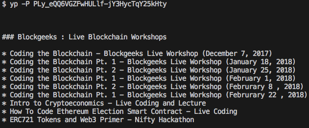

# Youtube Playlist Markdown CLI


Youtube Playlist Markdown CLI

### Requirements

* node 8.x.x

### Install


```sh
npm install -g youtube-playlist-markdown-cli
```

#### set your google api key

you need to get your API key, if you don't know how to do, maybe this video could help you.

[How to Get YouTube API Key - Easy way - YouTube](https://www.youtube.com/watch?v=_U_VS12uu-o)

then set up env

```
// for Mac
export GOOGLE_API_KEY="========== YOUR GOOGLE API KEY =========="

// for Windows
set GOOGLE_API_KEY=="========== YOUR GOOGLE API KEY =========="
```

[How To Edit System Environment Variables In Windows 10 - YouTube](https://www.youtube.com/watch?v=C-U9SGaNbwY)

### Usage via command mode


```
ym
ym -c UCJi9ZAuo99MqMuJUXiJjpsA
ym -p PLrG78JjvL7hWqX2FW54Ck8UP45fbWQXcu
ym -o PLrG78JjvL7hWqX2FW54Ck8UP45fbWQXcu
```



### Usage via reactive mode


``
ymr
``

## Relevant Projects

* [youtube-playlist-summary](https://github.com/alincode/youtube-playlist-summary)
* [youtube-playlist-markdown](https://github.com/alincode/youtube-playlist-markdown)

## License

MIT © [alincode](https://github.com/alincode/youtube-playlist-markdown-cli)
