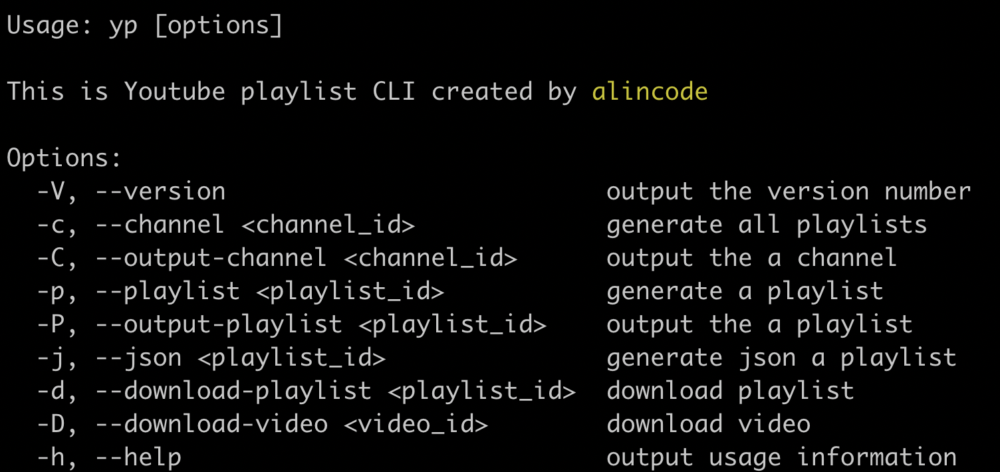

# Youtube Playlist Markdown CLI

### Usage via CLI


```sh
npm install -g youtube-playlist-markdown-cli
```

#### set your google api key

```
export GOOOGLE_API_KEY="========== YOUR GOOGLE API KEY =========="
```

#### command mode



```
ym
ym -c UCJi9ZAuo99MqMuJUXiJjpsA
ym -p PLrG78JjvL7hWqX2FW54Ck8UP45fbWQXcu
ym -o PLrG78JjvL7hWqX2FW54Ck8UP45fbWQXcu
```

#### reactive mode


``
ymr
``

## Relevant Projects

* [youtube-playlist-summary](https://github.com/alincode/youtube-playlist-summary)
* [youtube-playlist-markdown](https://github.com/alincode/youtube-playlist-markdown)

## License

MIT © [alincode](https://github.com/alincode/youtube-playlist-markdown-cli)
